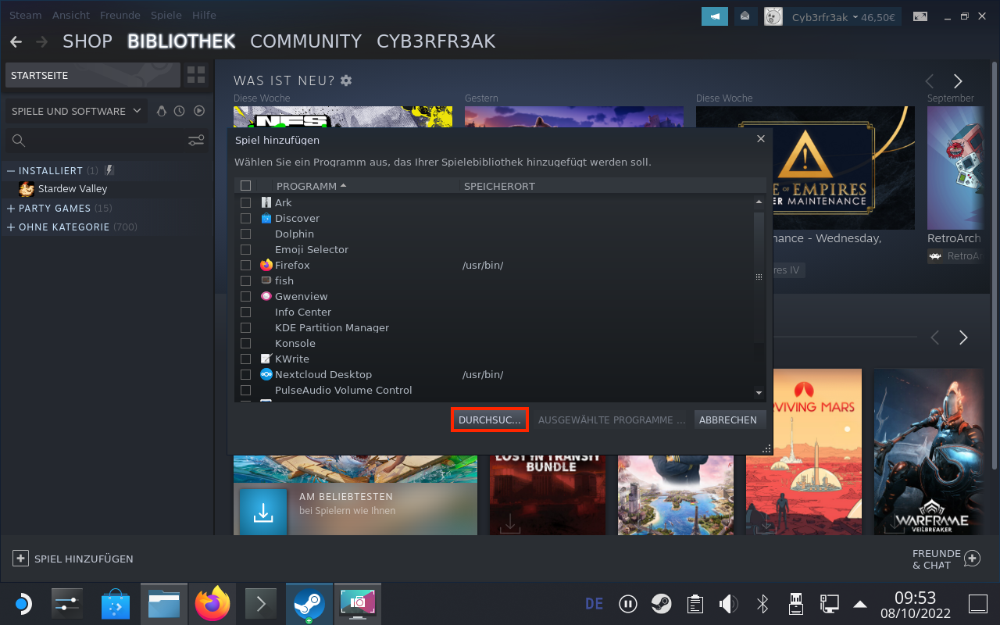
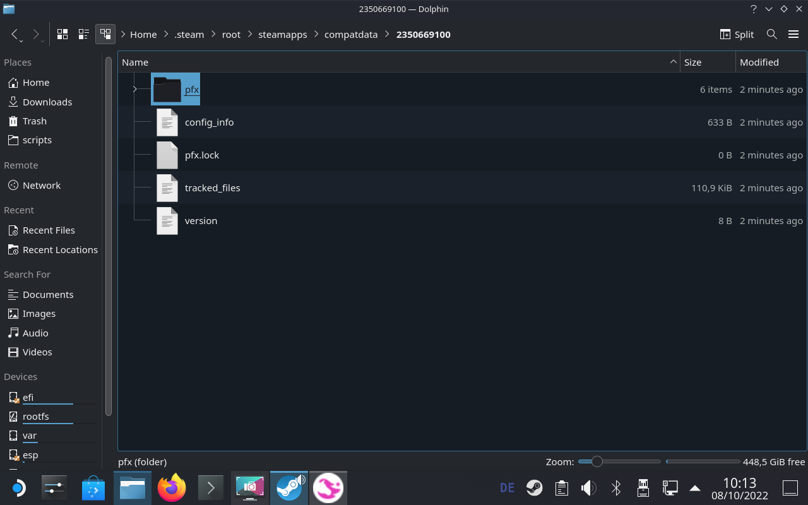

# Star Stable on Steam Deck

## Pre-Requisites

- Switch to Desktop Mode

- (Optional) Use a mouse+keyboard

# Install the game

## Step 1: Download the Setup file

The Star Stable Online homepage won't let you download the file on the Steam Deck directly, as it looks at your webbrowser's [user agent](https://developer.mozilla.org/en-US/docs/Web/HTTP/Headers/User-Agent) and determines that your device "is not supported". If you're an advanced user, you can edit your user agent, so the SSO homepage thinks that you're browsing from a Windows computer. Otherwise you can download the file from another Windows computer and copy it onto your Steam Deck using a thumbdrive, external drive, SSH, etc. you name it. For all the lazy ones, I'll put this [Star Stable Online Setup.exe](https://link.pinguincloud.de/sso) here.

In any way, place the file under `/home/deck/Downloads`

## Step 2: Add the file to Steam

Open Steam and add the setup file as a non-steam game.

### Step 2.1

**Note:** You need to select "All files" for the exe file to show up.

## Step 3: Enable compatibility mode

Open the properties of the added game and enable the compatibility mode.

### Step 3.1: Select the latest stable Proton version.

**⚠️ Note:** Proton 7.0-4 shown in the screenshot below is outdated. As of now, select Proton 8.0-2 or higher

## Step 4: Determine the data folder of the game

Open the following path `/home/deck/.steam/root/steamapps/compatdata`

If `compatdata` doesn't exist yet, then just ignore that for now.

### Step 4.1: Start the game (launcher)

When you start the game, Steam will create a folder to store all the data that the game creates. We'll need that folder in a couple of steps (in this example 2350669100).

## Step 5: Install the game

Leave everything untouched and install the game.

### Step 5.1: Leave the checkbox enabled

## Step 6: Login

## Step 7: Determine the main game file

Open the folder of [Step 4.1](#step-41-start-the-game) and navigate to the `Star Stable Online.exe` file as shown in the screenshots

### Step 7.1: Copy the path of the main game file

Right-click on `Star Stable Online.exe` and click on `Copy Location`.

## Step 8: Start the game

Wait for the launcher to finish the downloads/updates and click on Play. This should start the game successfully. Exit the game for now.

## Step 9: Update Steam game entry

The entry in steam is still pointing to the Setup file in your Downloads folder. We need to change it to point to the main game file. To do so, open the properties of the game in Steam again.

### Step 9.1: Change target

Delete the content of the target field.

Paste the path copied from [Step 7.1](#step-71-copy-the-path-of-the-main-game-file) and add a double-quote " before and after the path.

Example: `"/home/deck/.steam/root/steamapps/compatdata/2350669100/pfx/drive_c/Program Files (x86)/Star Stable Online/Star Stable Online.exe"`

### Step 9.2

In the field below, do the same as in [Step 9.1](#step-91-change-target) but leave out `Star Stable Online.exe`.

Example: `"/home/deck/.steam/root/steamapps/compatdata/2350669100/pfx/drive_c/Program Files (x86)/Star Stable Online/"`

### Step 9.3

Change the name of the entry to `Star Stable` or whatever you want.

### Step 10: Return to Gaming Mode

# Adjust controls

Enable at least one input to act as a mouse input (e.g. trackpad).

# Start the game in Gaming Mode

After logging in, you can start the game and the launcher will show an error message. Ignore that message and press the `Steam` button. You will see that the game now has two windows open. Switch to the second window and it should show the game.

If you then only see a small loading bar on the screen (and not the full screen), tap on the touchscreen a few times and the full game should appear.

After factory-resetting my Steam Deck, I've also encountered an issue, where switching to the second window did nothing and left me with the launcher window only. I tried to mess around with different Proton versions, ending up uninstalling the game, removing the data folder and starting from scratch, eventually restarting the Steam Deck in between, and the issue didn't occur again.
